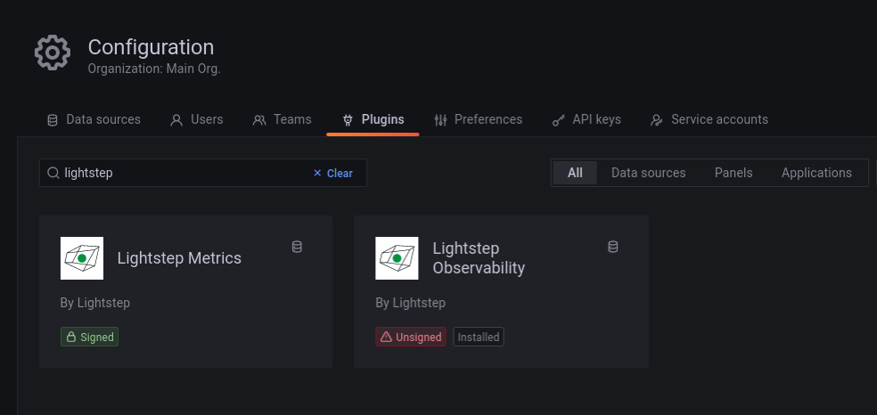
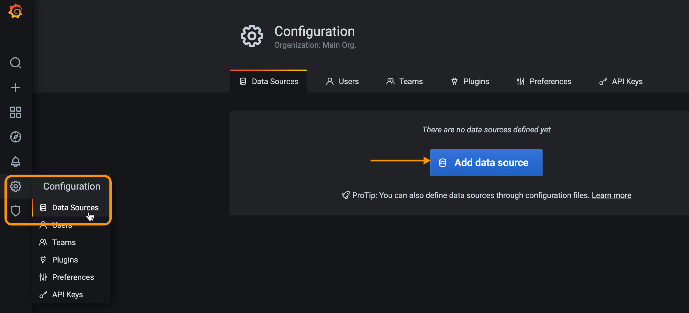
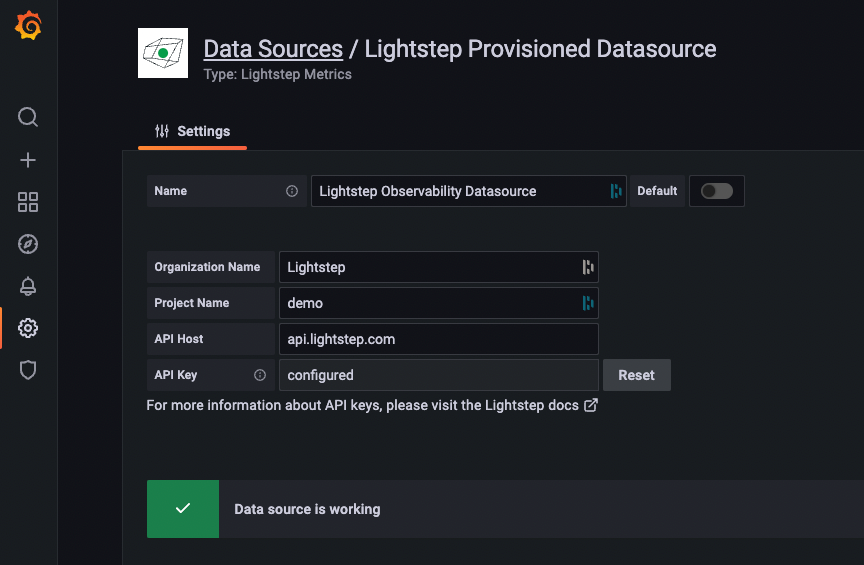
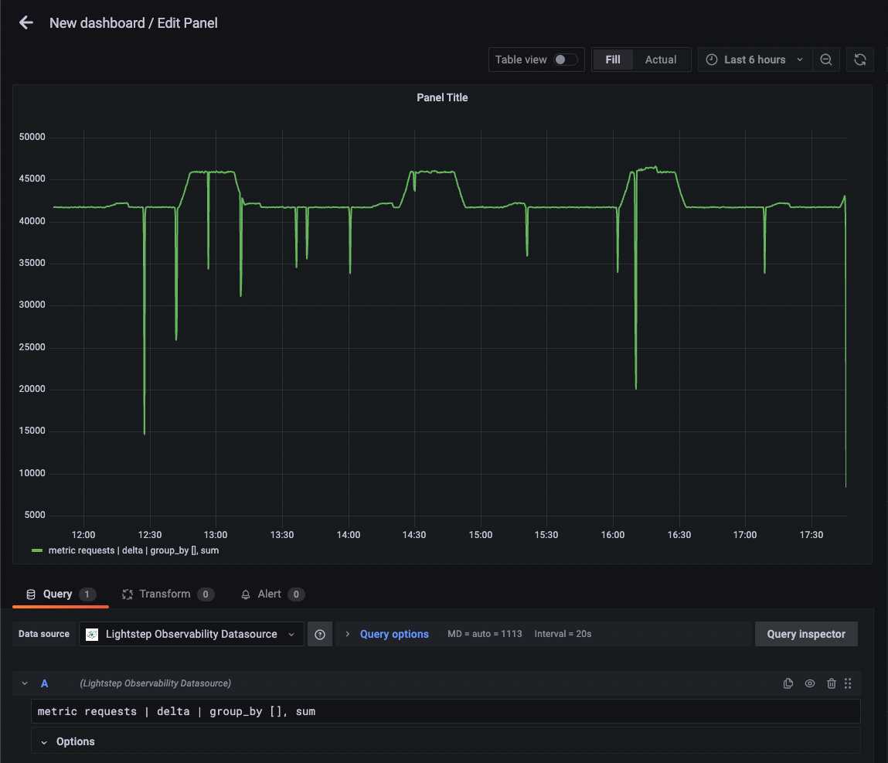
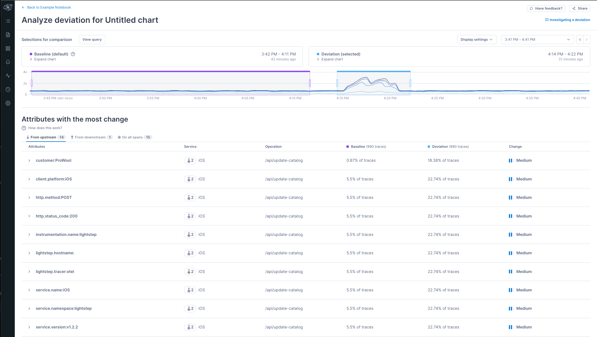

# Lightstep Observability Data Source

The Lightstep Observability Data Source allows you to view and visualize telemetry data from [Lightstep Observability](https://lightstep.com) directly in Grafana. Using Lightstep as your data source, you can jump directly from a chart in Grafana into Lightstep Observability to find the root cause of an issue, using advanced functionality like [Change Intelligence](https://docs.lightstep.com/docs/investigate-deviation).


## Prerequisites

You'll need the following to enable and use the plugin:

- A Grafana account (version 7 and greater)

  **NOTE:** _The plugin only supports graph and time series charts._

- [Telemetry data](https://docs.lightstep.com/docs/welcome-to-lightstep) reporting to Lightstep.

- Your Lightstep "Organization" and "Project" name. Both can be found on on the [Project Settings page](https://docs.lightstep.com/docs/create-projects-for-your-environments) of Lightstep.

  

- A Lightstep [API key](https://docs.lightstep.com/docs/create-and-manage-api-keys) with Viewer permissions created just for Grafana.

  Paste the key someplace safe, as you will not be able to access it again from Lightstep.

## Installation

### Recommended: Install directly from GitHub

1. Download the [zip file](https://github.com/lightstep/lightstep-observability-datasource/releases) for the plugin.

2. Unzip the release into your Grafana `plugins` directory.

    The value of`YOUR_GRAFANA_PLUGINS_DIR` will depend on your system and how Grafana was installed. For example, it may be at `/var/lib/grafana/plugins` on Linux.

   ```bash
   unzip -d [YOUR_GRAFANA_PLUGINS_DIR]/lightstep-observability-datasource lightstep-observability-datasource-X.Y.Z.zip
   ```

3. Ensure your Grafana installation is configured to allow unsigned plugins.

   This generally requires ensuring the `allow_loading_unsigned_plugins` value in the `plugins` section of `grafana.ini` is updated to include `lightstep-observability-plugin` in the list of allowed plugins.

   ```ini
   [plugins]
   ;enable_alpha = false
   ;app_tls_skip_verify_insecure = false
   # Enter a comma-separated list of plugin identifiers to identify plugins that are allowed to be loaded even if they lack a valid signature.
   allow_loading_unsigned_plugins = lightstep-observability-datasource
   ```

4. In the Grafana plugin installation, install the **Lightstep Observability** (unsigned) datasource. If you see only the **Lightstep Metrics** plugin, your installation likely has not succeeded.

   

For more information, follow the steps in the [Grafana documentation](https://grafana.com/docs/grafana/latest/administration/plugin-management/#install-plugin-on-local-grafana) for local installations.

### Install using the Grafana CLI

1. Install the plugin from the Grafana CLI using [Grafana's plugin installation instructions](https://grafana.com/docs/grafana/latest/plugins/installation/).

   ```sh
   grafana-cli plugins install lightstep-observability-datasource
   ```

## Enable the Lightstep Observability Data Source in Grafana

After you install the plugin, follow these steps. Steps may vary slightly depending on your version of Grafana.

1. Restart the Grafana server so it can discover the new plugin.
2. In the Navigation Bar, choose **Configuration**, select **Data Sources**, and click **Add data source**.

   

3. Start typing `Lightstep` in the search field to find the **Lightstep Observability data source** and click **Select**. If you do not see the Lightstep plugin listed, please ensure it has been correctly installed or reach out to the Lightstep team for further assistance.

4. Enter your Lightstep organization and project name. If you want to use the data source with multiple projects, enter the name of each project separated by a comma into the project name field. Then paste in your Lightstep [API key](https://docs.lightstep.com/docs/create-and-manage-api-keys) and click **Save & Test**.

   Grafana confirms that it's connected to Lightstep.

   

You can now create dashboards and charts in Grafana using data provided by your Lightstep project.

## Create Grafana charts from Lightstep Observability

With the Lightstep plugin installed, you can query your Lightstep data directly from Grafana.

1. From the **Query** tab of the Edit Panel, select **Lightstep Observability data source** from the **Data source** drop down.

2. Add a query to the text input, using the [Lightstep's Unified Query Language (UQL)](https://docs.lightstep.com/docs/uql-concepts).

   Click out of the field (or press `shift` + `Enter`) to run your query.

   

3. Choose the visualization for the chart (Lightstep supports either **Graph** or **Time Series**). Click **Apply** to create the graph.

## Investigate a Deviation from a Grafana chart

Now that you have a chart in Grafana, when you notice a unexpected change in your data, you can investigate in Lightstep to rapidly find the root cause.

To investigate, click into the deviation and select **Create a Notebook in Lightstep**.


You're taken into a Notebook within Lightstep with your query pre-populated, where you can [start your investigation](https://docs.lightstep.com/docs/investigate-deviation).


Utilize Change Intelligence or trace views to further your investigation.



## Developing and testing the plugin with Docker

The `Makefile` in this repository contains a `make dev` target that builds this plugin and uses `docker-compose` to run a new instance of Grafana for development and testing.

When running, the local development instance of Grafana should be available at [localhost:3000](http://localhost:3000/).

1. As with most Grafana Docker images, the default login/password is `admin`/`admin`.
2. Go to **Settings** > **Lightstep Provisioned Datasource** and set the Project Name, API host, and API key (based on your Lightstep account). **Save & test** the configuration.
3. Create a new dashboard with a new Panel, select **Lightstep Provisioned Datasource** as the data source and enter a query.

Note: the Makefile creates a local docker volume `grafana-data-lmd` to persist settings across launches, so configuration is necessarily only on the first run.
